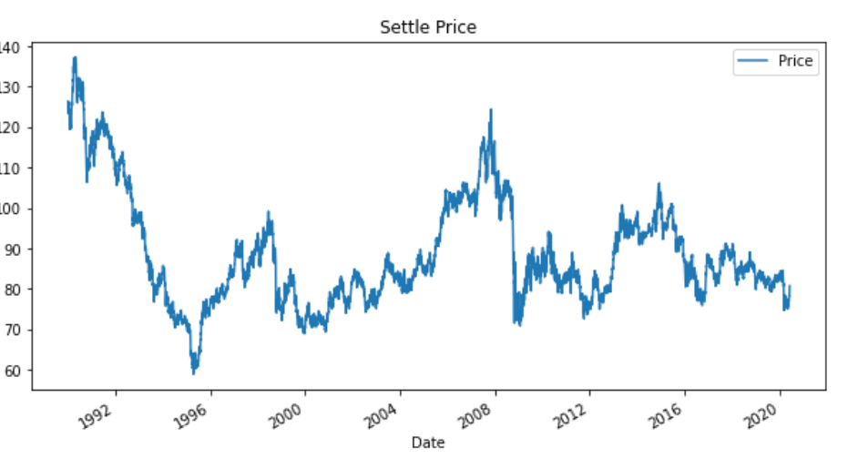
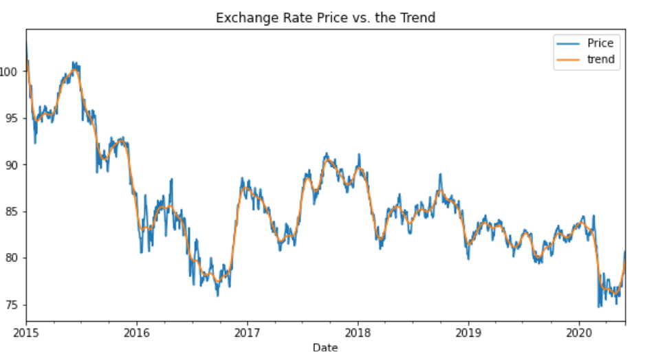
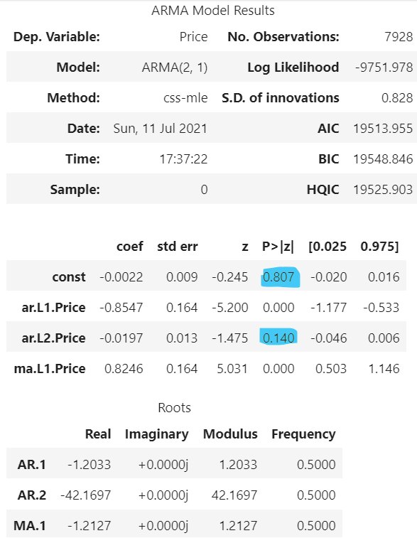
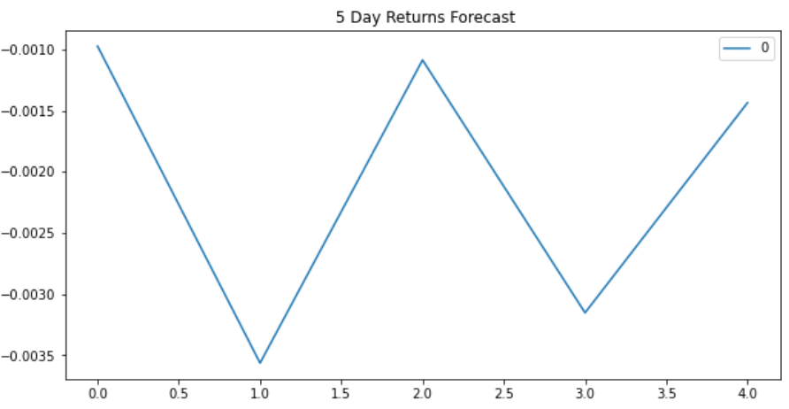
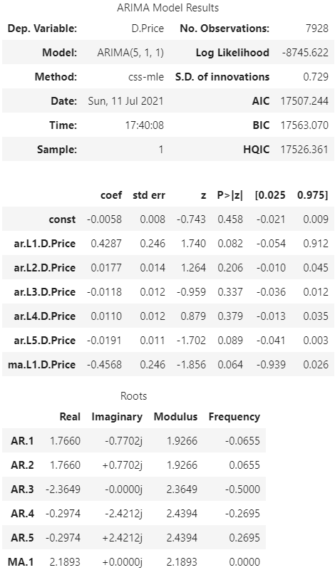
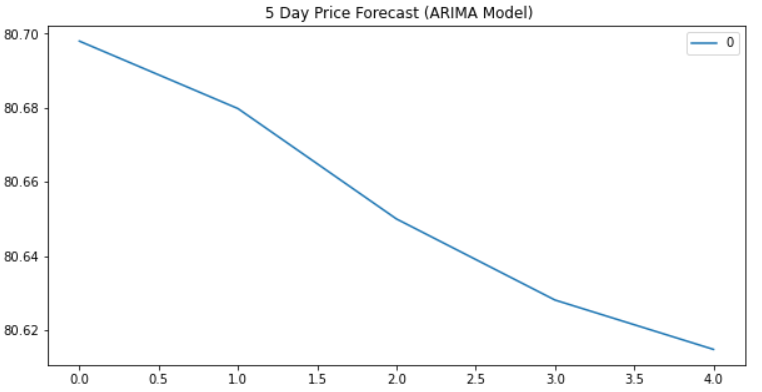
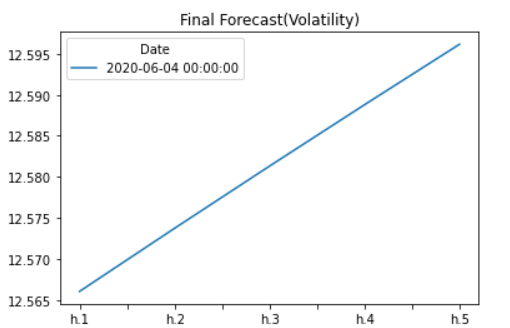

# Time-Series Analysis: CAD/JPY

### We will apply Hodrick-Prescott filter, ARMA/ARIMA, and GARCH models to perform a Time Series Forecasting and a Linear Regression Forecasting using Out-of-sample, and In-sample performance to determine if there is any predictable behaviour in the foreign currency.

#

The closing price above shows long pattern here showing that the Canadian dollar is gradually falling as the Japanese Yen strengthens, although there is short ups and downs proving to be consistent between every few years or so.

#

Using Hodrick-Prescott filter to decompose the exchange rate price to seperate the trend and noise and then plotting to see how the exchange rate price is against the trend. There is a clear trend of a short term pattern involved here in between the end of year 2016 until first quarter of year 2020, many ups and downs. We could perhaps use this strategy to buy when the blue line is above the orange line and sell when it passes below the orange line.

#

Using ARMA model to forecast returns. Here, we can see for "const" and "ar.L2", the p-values are > 0.05. This would not be suited as good fit.

#

Using the ARIMA model to forecast price. According to the forecast model, the Yen seems to be gaining strength.

#

###### Note: You may have to "pip install arch" in your environment to use GARCH model

The above model plot was from forecasting near-term volatility of Japanese Yen exchange rate returns using GARCH model. The h.1 on the figure represents day 1. Therefore, it is forecasted for the following 5 days from the last day of the returns. According to the GARCH model's figure above, there is a higher chance of increased volatility in the next 5 days. 

Conclusion:

Based on this time series analysis, I would not buy Yen at this time as the volatility rate risk is expected to increase. 

Also, I would not feel confident in using this model for trading as the AIC and BIC is far from the truth.

As for the Linear Regression Analysis, the Out-of-sample(testing) data performs better as RMSE is lower in comparison to the In-Sample data(training data).